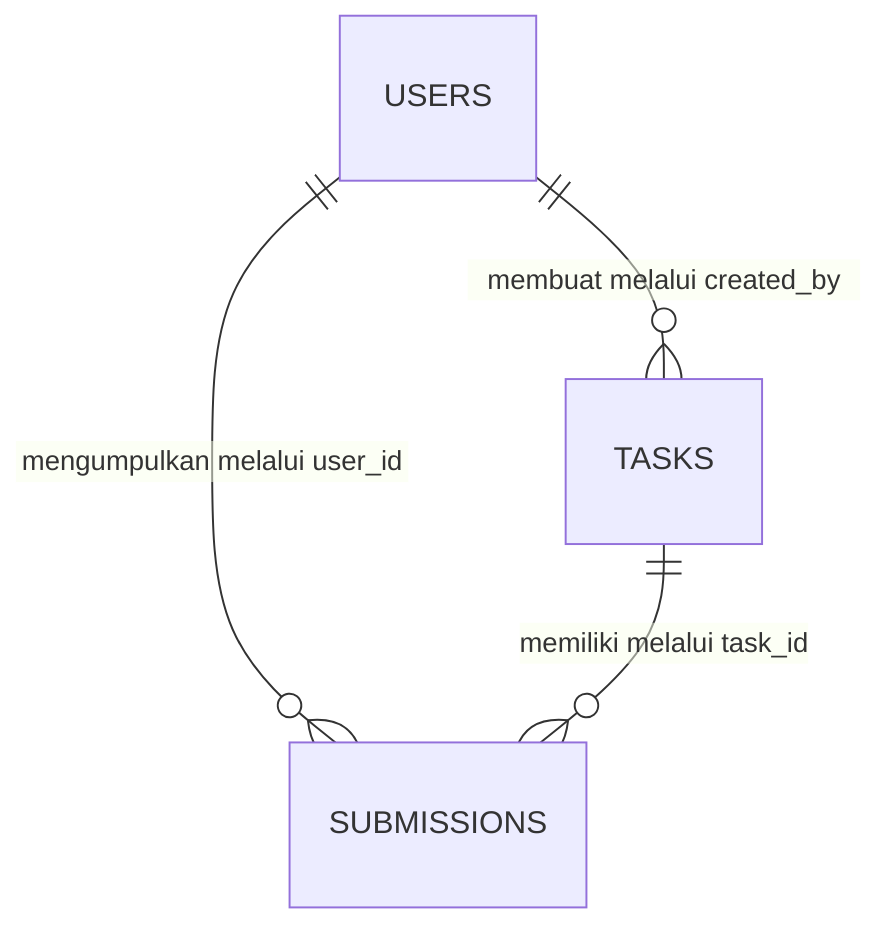

# TaskFlow Pelatihan

TaskFlow Pelatihan adalah prototype **Mini Dashboard Manajemen Tugas** untuk membantu instruktur mengelola tugas pelatihan dan membantu peserta melihat serta mengumpulkan tugas. Aplikasi menggunakan autentikasi berbasis session dengan dua peran pengguna: admin sebagai instruktur dan user sebagai peserta.

## Daftar Isi

- [Latar Belakang dan Tujuan](#latar-belakang-dan-tujuan)
- [Role Pengguna](#role-pengguna)
- [Fitur Admin](#fitur-admin)
- [Fitur Peserta](#fitur-peserta)
- [Teknologi yang Digunakan](#teknologi-yang-digunakan)
- [Struktur Database](#struktur-database)
- [Relasi Database](#relasi-database)
- [Struktur Folder](#struktur-folder)
- [Persyaratan Sistem](#persyaratan-sistem)
- [Instalasi](#instalasi)
- [Konfigurasi Database MySQL](#konfigurasi-database-mysql)
- [Konfigurasi Environment](#konfigurasi-environment)
- [Migration dan Seeder](#migration-dan-seeder)
- [Menjalankan Aplikasi](#menjalankan-aplikasi)
- [Menjalankan Test](#menjalankan-test)
- [Build Frontend](#build-frontend)
- [Akun Demo](#akun-demo)
- [Penyimpanan File](#penyimpanan-file)
- [Screenshot](#screenshot)
- [Keterbatasan Aplikasi](#keterbatasan-aplikasi)
- [Rencana Pengembangan](#rencana-pengembangan)
- [Informasi Developer](#informasi-developer)

## Latar Belakang dan Tujuan

Pengelolaan tugas pelatihan memerlukan tempat terpusat agar instruktur dapat membuat tugas, memantau pengumpulan, dan mengenali peserta yang belum mengumpulkan. Peserta juga memerlukan tampilan sederhana untuk melihat deadline, instruksi, dan status pengumpulan miliknya.

TaskFlow Pelatihan dibuat dengan tujuan:

- menyediakan pengelolaan tugas pelatihan dalam satu aplikasi;
- memisahkan akses instruktur dan peserta berdasarkan role;
- memudahkan peserta mengetahui tugas yang perlu segera dikerjakan;
- membantu instruktur memonitor pengumpulan seluruh peserta;
- menjadi prototype yang sederhana, mudah dipelajari, dan mudah dikembangkan.

## Role Pengguna

### Admin / Instruktur

Admin memiliki akses ke area `/admin` untuk mengelola tugas, melihat ringkasan aplikasi, memonitor pengumpulan, dan melihat data peserta.

### User / Peserta

Peserta memiliki akses ke dashboard peserta, daftar tugas, detail tugas, serta pengumpulan miliknya sendiri. Peserta tidak dapat membuka halaman admin atau mengakses pengumpulan peserta lain.

Registrasi mandiri belum tersedia. Seluruh akun pengguna disiapkan melalui seeder.

## Fitur Admin

- Login dan logout menggunakan autentikasi session Laravel.
- Dashboard dengan data nyata dari database:
    - total tugas;
    - tugas aktif;
    - total peserta;
    - total pengumpulan;
    - pengumpulan terlambat;
    - tugas mendekati deadline;
    - tugas terbaru, pengumpulan terbaru, deadline terdekat, dan progres pengumpulan.
- Pengelolaan tugas:
    - melihat daftar dan detail tugas;
    - membuat, mengubah, dan menghapus tugas;
    - mengubah status tugas;
    - mencari berdasarkan judul;
    - memfilter berdasarkan status;
    - pagination.
- Monitoring pengumpulan per tugas:
    - ringkasan total peserta, sudah mengumpulkan, belum mengumpulkan, terlambat, dan persentase pengumpulan;
    - seluruh peserta tetap ditampilkan, termasuk yang belum mengumpulkan;
    - pencarian nama atau email;
    - filter status pengumpulan;
    - melihat detail pengumpulan;
    - mengunduh file privat berdasarkan record pengumpulan;
    - membuka tautan pengumpulan;
    - export data monitoring ke CSV.
- Data peserta beserta jumlah tugas, jumlah pengumpulan, jumlah belum mengumpulkan, dan jumlah terlambat.
- Indikator deadline berwarna hijau, kuning, atau merah berdasarkan waktu yang tersisa.

## Fitur Peserta

- Login dan logout menggunakan autentikasi session Laravel.
- Dashboard personal dengan:
    - sapaan berdasarkan nama peserta;
    - total tugas aktif;
    - sudah dikumpulkan;
    - belum dikumpulkan;
    - terlambat;
    - deadline terdekat;
    - tugas yang perlu segera dikerjakan;
    - pengumpulan terbaru milik peserta.
- Daftar tugas yang dapat dilihat peserta:
    - tugas aktif dan tugas yang telah ditutup;
    - pencarian berdasarkan judul;
    - filter kategori;
    - urutan deadline terdekat;
    - pagination.
- Detail tugas yang memuat deskripsi, instruksi, tanggal mulai, deadline, jenis pengumpulan, status, sisa waktu, dan status personal peserta.
- Membuat dan memperbarui satu pengumpulan untuk setiap tugas.
- Pengumpulan dapat berupa file, tautan, atau minimal salah satunya sesuai jenis pengumpulan tugas.
- Catatan pengumpulan bersifat opsional.
- Status pengumpulan ditentukan otomatis menjadi tepat waktu atau terlambat.
- Halaman **Pengumpulan Saya** yang menampilkan:
    - jumlah total pengumpulan, tepat waktu, dan terlambat;
    - riwayat pengumpulan terbaru beserta tugas, deadline, file, tautan, dan status;
    - akses ke detail dan pembaruan pengumpulan yang masih dapat diperbarui;
    - pagination untuk riwayat pengumpulan.
- Peserta hanya dapat melihat dan memperbarui pengumpulan miliknya sendiri.

## Teknologi yang Digunakan

| Bagian           | Teknologi                                     |
| ---------------- | --------------------------------------------- |
| Backend          | PHP 8.3 dan Laravel 13                        |
| Template         | Laravel Blade                                 |
| Styling          | Tailwind CSS 4                                |
| Frontend build   | Vite 8                                        |
| JavaScript       | JavaScript sederhana tanpa framework tambahan |
| Database         | MySQL                                         |
| ORM              | Laravel Eloquent                              |
| Autentikasi      | Laravel session authentication                |
| Penyimpanan file | Laravel Storage, disk `local` privat          |
| Testing          | PHPUnit 12 melalui Laravel Test Runner        |

Versi yang digunakan pada lingkungan pengembangan saat README ini dibuat:

- PHP 8.3.4;
- Composer 2.9.7;
- Node.js 24.7.0;
- NPM 11.5.1;
- Laravel Framework 13.23.0.

## Struktur Database

### Tabel `users`

Menyimpan akun admin dan peserta.

| Field utama                | Keterangan                          |
| -------------------------- | ----------------------------------- |
| `id`                       | Primary key                         |
| `name`                     | Nama pengguna                       |
| `email`                    | Email unik untuk login              |
| `password`                 | Password yang di-hash Laravel       |
| `role`                     | `admin` atau `user`, default `user` |
| `remember_token`           | Token fitur remember me             |
| `created_at`, `updated_at` | Waktu pembuatan dan perubahan data  |

### Tabel `tasks`

Menyimpan tugas yang dibuat oleh admin.

| Field utama                | Keterangan                          |
| -------------------------- | ----------------------------------- |
| `id`                       | Primary key                         |
| `title`                    | Judul tugas                         |
| `description`              | Deskripsi tugas                     |
| `instructions`             | Instruksi opsional                  |
| `category`                 | Kategori opsional                   |
| `start_date`               | Tanggal mulai opsional              |
| `deadline`                 | Batas waktu pengumpulan             |
| `submission_type`          | `file`, `link`, atau `file_or_link` |
| `status`                   | `draft`, `active`, atau `closed`    |
| `created_by`               | Foreign key ke `users.id`           |
| `created_at`, `updated_at` | Waktu pembuatan dan perubahan data  |

### Tabel `submissions`

Menyimpan satu pengumpulan peserta untuk setiap tugas.

| Field utama                | Keterangan                                           |
| -------------------------- | ---------------------------------------------------- |
| `id`                       | Primary key                                          |
| `task_id`                  | Foreign key ke `tasks.id`                            |
| `user_id`                  | Foreign key ke `users.id`                            |
| `file_path`                | Path file privat, opsional                           |
| `original_file_name`       | Nama asli file untuk tampilan dan download, opsional |
| `submission_link`          | Tautan pengumpulan, opsional                         |
| `note`                     | Catatan peserta, opsional                            |
| `submitted_at`             | Waktu pengumpulan terakhir                           |
| `status`                   | `submitted` atau `late`                              |
| `created_at`, `updated_at` | Waktu pembuatan dan perubahan data                   |

Kombinasi `task_id` dan `user_id` memiliki unique constraint. Aturan ini memastikan satu peserta hanya mempunyai satu record pengumpulan untuk satu tugas. Pengiriman ulang akan memperbarui record yang sudah ada.

Selain tiga tabel utama, migration bawaan Laravel juga membuat tabel pendukung untuk session, cache, queue, password reset, dan failed jobs.

## Relasi Database



Relasi Eloquent yang digunakan:

- `User::createdTasks()` — satu admin dapat membuat banyak tugas;
- `User::submissions()` — satu peserta dapat memiliki banyak pengumpulan;
- `Task::creator()` — setiap tugas memiliki satu pembuat;
- `Task::submissions()` — satu tugas dapat memiliki banyak pengumpulan dari peserta berbeda;
- `Submission::task()` — setiap pengumpulan terkait dengan satu tugas;
- `Submission::user()` — setiap pengumpulan dimiliki oleh satu peserta.

Perilaku foreign key:

- penghapusan tugas menghapus record pengumpulan terkait dan file privat yang valid;
- pengguna tidak ikut terhapus ketika tugas dihapus;
- pengguna yang masih menjadi pembuat tugas atau pemilik pengumpulan tidak dapat dihapus secara otomatis oleh foreign key.

## Struktur Folder

```text
taskflow-bpvp-laravel/
├── app/
│   ├── Http/
│   │   ├── Controllers/       # Controller autentikasi, dashboard, tugas, dan pengumpulan
│   │   ├── Middleware/        # Pembatasan role admin dan peserta
│   │   └── Requests/          # Validasi login, tugas, dan pengumpulan
│   ├── Models/                # User, Task, dan Submission
│   └── Providers/
├── bootstrap/                 # Bootstrap aplikasi dan alias middleware
├── config/                    # Konfigurasi Laravel
├── database/
│   ├── factories/             # Factory model
│   ├── migrations/            # Struktur tabel database
│   └── seeders/               # Akun dan data demonstrasi
├── public/                    # Entry point dan hasil build frontend
├── resources/
│   ├── css/app.css            # Tailwind dan identitas visual global
│   ├── js/app.js              # Drawer, flash message, dan konfirmasi hapus
│   └── views/                 # Layout, komponen, dan halaman Blade
├── routes/web.php             # Route aplikasi berbasis web dan session
├── storage/app/private/       # Penyimpanan file pengumpulan privat
├── tests/                     # Feature test dan unit test
├── .env.example               # Contoh konfigurasi environment
├── composer.json              # Dependency PHP
├── package.json               # Dependency frontend
└── vite.config.js             # Konfigurasi Vite dan Tailwind
```

## Persyaratan Sistem

Pastikan perangkat memiliki:

- PHP 8.3 atau lebih baru beserta ekstensi yang dibutuhkan Laravel;
- Composer 2;
- MySQL 8 atau versi kompatibel;
- Node.js 20.19 atau lebih baru;
- NPM;
- Git;
- browser modern.

Untuk memeriksa versi yang terpasang:

```bash
php --version
composer --version
mysql --version
node --version
npm --version
```

## Instalasi

Clone repository dan instal dependency bawaan proyek:

```bash
git clone URL_REPOSITORY
cd taskflow-bpvp-laravel
composer install
npm install
cp .env.example .env
php artisan key:generate
```

Pada Windows PowerShell, perintah penyalinan `.env` dapat diganti dengan:

```powershell
Copy-Item .env.example .env
```

Setelah itu, buat database MySQL dan sesuaikan konfigurasi `.env` sebelum menjalankan migration.

## Konfigurasi Database MySQL

Masuk ke MySQL menggunakan akun lokal yang memiliki izin membuat database:

```bash
mysql -u root -p
```

Buat database dengan karakter UTF-8:

```sql
CREATE DATABASE taskflow_pelatihan
    CHARACTER SET utf8mb4
    COLLATE utf8mb4_unicode_ci;
```

Keluar dari MySQL:

```sql
EXIT;
```

Pengguna `root` hanya merupakan contoh untuk lingkungan lokal. Gunakan pengguna database dengan hak akses terbatas pada lingkungan selain lokal.

## Konfigurasi Environment

Buka file `.env` dan sesuaikan bagian berikut:

```dotenv
APP_NAME="TaskFlow Pelatihan"
APP_ENV=local
APP_KEY=
APP_DEBUG=false
APP_URL=http://127.0.0.1:8000

DB_CONNECTION=mysql
DB_HOST=127.0.0.1
DB_PORT=3306
DB_DATABASE=taskflow_pelatihan
DB_USERNAME=root
DB_PASSWORD=

SESSION_DRIVER=database
CACHE_STORE=database
QUEUE_CONNECTION=database
FILESYSTEM_DISK=local
```

Catatan konfigurasi:

- isi `DB_USERNAME` dan `DB_PASSWORD` sesuai akun MySQL lokal;
- jangan memasukkan credential lokal ke source code atau commit Git;
- jalankan `php artisan key:generate` apabila `APP_KEY` masih kosong;
- gunakan `APP_DEBUG=false` di lingkungan produksi;
- file `.env` telah dikecualikan dari Git dan `.env.example` tetap menjadi acuan konfigurasi.

Untuk menguji koneksi database setelah konfigurasi diisi:

```bash
php artisan migrate:status
```

## Migration dan Seeder

Jalankan migration sekaligus seeder:

```bash
php artisan migrate --seed
```

Perintah tersebut membuat tabel aplikasi dan mengisi:

- satu akun admin;
- empat akun peserta;
- tiga tugas contoh;
- beberapa record pengumpulan contoh.

Untuk mengulang database dari awal pada lingkungan pengembangan:

```bash
php artisan migrate:fresh --seed
```

> Perhatian: `migrate:fresh` menghapus seluruh tabel dan data pada database yang dipilih. Jangan jalankan pada database yang berisi data penting.

## Menjalankan Aplikasi

Build aset frontend lalu jalankan server Laravel:

```bash
npm run build
php artisan serve
```

Aplikasi secara default dapat dibuka melalui:

```text
http://127.0.0.1:8000
```

Untuk pengembangan frontend dengan pembaruan otomatis, jalankan perintah berikut pada terminal terpisah:

```bash
npm run dev
```

## Menjalankan Test

Jalankan seluruh test aplikasi:

```bash
php artisan test
```

Alternatif melalui script Composer:

```bash
composer test
```

Test mencakup autentikasi dan role, pengelolaan tugas, daftar tugas peserta, pengumpulan, monitoring admin, data dashboard, indikator deadline, export CSV, validasi, dan pemeriksaan keamanan utama.

Konfigurasi test menggunakan database SQLite sementara sehingga tidak menggunakan data pada database MySQL lokal.

## Build Frontend

Build production:

```bash
npm run build
```

Hasil build dibuat di folder `public/build` dan dimuat melalui integrasi Laravel Vite.

Development server Vite:

```bash
npm run dev
```

Proyek menggunakan Tailwind CSS melalui plugin Vite. Tidak diperlukan framework JavaScript tambahan.

## Akun Demo

Seeder menyediakan akun berikut:

| Role               | Email                   | Password   |
| ------------------ | ----------------------- | ---------- |
| Admin / Instruktur | `admin@taskflow.test`   | `password` |
| User / Peserta     | `peserta@taskflow.test` | `password` |

Password demo hanya digunakan untuk pengembangan dan pengujian lokal. Ganti password sebelum aplikasi digunakan di lingkungan lain.

## Penyimpanan File

File pengumpulan disimpan melalui Laravel Storage pada disk `local` yang bersifat privat:

```text
storage/app/private/submissions/
```

Ketentuan penyimpanan yang diterapkan:

- format yang diperbolehkan: PDF, DOC, DOCX, ZIP, PNG, JPG, dan JPEG;
- ukuran maksimal 5 MB;
- nama penyimpanan utama dibuat oleh Laravel, bukan menggunakan nama file pengguna secara langsung;
- nama file asli hanya disimpan sebagai metadata untuk tampilan dan download;
- file tidak dapat diakses langsung melalui URL publik;
- download dilakukan melalui route admin yang memeriksa role, record pengumpulan, keamanan path, dan keberadaan file;
- ketika file diperbarui, file lama dihapus setelah file baru dan data berhasil disimpan;
- ketika tugas dihapus, file pengumpulan terkait ikut dibersihkan.

Perintah `php artisan storage:link` tidak diperlukan untuk file pengumpulan karena file disimpan pada disk privat.

Seeder membuat metadata pengumpulan contoh, tetapi tidak menyertakan berkas fisik demo. Karena itu, download untuk record file bawaan seeder dapat menampilkan pesan bahwa file tidak ditemukan sampai peserta mengunggah file nyata.

## Screenshot

Screenshot belum disertakan dalam repository. Gunakan daftar berikut sebagai placeholder dokumentasi visual:

| Halaman                | Lokasi file yang disarankan                    |
| ---------------------- | ---------------------------------------------- |
| Login                  | `docs/screenshots/login.png`                   |
| Dashboard admin        | `docs/screenshots/admin-dashboard.png`         |
| Kelola tugas           | `docs/screenshots/admin-tasks.png`             |
| Monitoring pengumpulan | `docs/screenshots/admin-monitoring.png`        |
| Dashboard peserta      | `docs/screenshots/participant-dashboard.png`   |
| Daftar tugas peserta   | `docs/screenshots/participant-tasks.png`       |
| Pengumpulan saya       | `docs/screenshots/participant-submissions.png` |
| Form pengumpulan       | `docs/screenshots/submission-form.png`         |

Saat screenshot sudah tersedia, bagian ini dapat diperbarui dengan sintaks Markdown berikut:

```markdown

```

## Keterbatasan Aplikasi

- Aplikasi masih berupa prototype Mini Dashboard Manajemen Tugas.
- Registrasi mandiri belum tersedia.
- Akun pengguna disiapkan melalui seeder.
- Belum tersedia fitur lupa password dan verifikasi email.
- Belum tersedia notifikasi email atau notifikasi realtime.
- Belum tersedia sistem penilaian dan umpan balik tugas.
- Belum tersedia penyimpanan cloud; file menggunakan Laravel Storage pada server lokal.
- Belum tersedia export selain CSV monitoring pengumpulan.
- Seeder tidak menyertakan berkas fisik untuk metadata file pengumpulan contoh.

## Rencana Pengembangan

Pengembangan berikutnya dapat dilakukan secara bertahap:

1. menambahkan pengelolaan akun peserta oleh admin;
2. menambahkan fitur lupa password;
3. menambahkan notifikasi email untuk tugas dan deadline;
4. menambahkan penilaian dan umpan balik instruktur;
5. menambahkan dukungan penyimpanan cloud;
6. menambahkan pengujian end-to-end pada browser.

Rencana tersebut belum tersedia pada implementasi saat ini.

## Informasi Developer

- **Developer:** Juhari
- **Konteks:** Proyek tes praktik Web Developer
- **Aplikasi:** TaskFlow Pelatihan
- **Arsitektur:** Laravel MVC dengan Blade

Dokumentasi ini disusun berdasarkan implementasi aktual proyek. Ganti `URL_REPOSITORY` dan tambahkan informasi kontak developer sebelum repository dipublikasikan.
